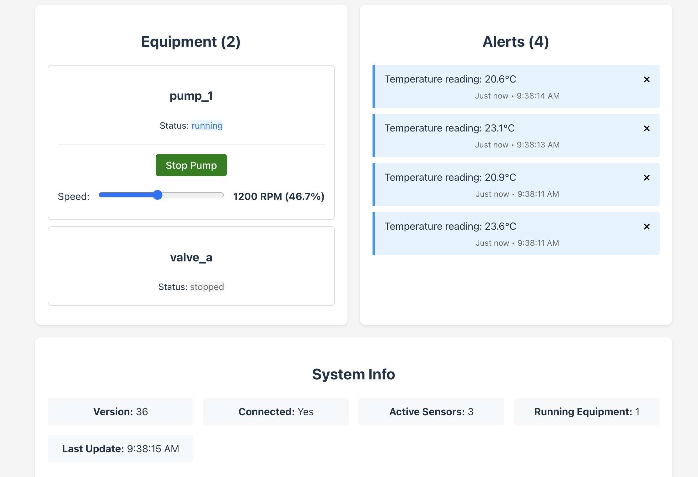

# Laboratory State Synchronization with JSON Patch



An experimental application demonstrating real-time state synchronization between a web frontend and a Python backend using WebSockets and JSON Patch. This project is designed as a foundation for laboratory automation software where multiple interfaces need to stay synchronized with equipment state.

## 🎯 Project Overview

This application explores a novel approach to state management in laboratory software:

- **WebSocket-based state synchronization**: Instead of traditional request-response patterns, state changes are broadcasted via WebSockets using JSON Patch
- **Decoupled architecture**: Frontend and backend maintain their own state representations but stay synchronized through patch operations
- **Real-time updates**: All connected clients receive immediate updates when any part of the lab state changes
- **Focus on developer experience**: Laboratory software developers can focus on domain logic rather than state synchronization

## 🏗️ Architecture

The system consists of two main components:

### Backend (`/app` folder)

- **FastAPI** server with WebSocket support
- Maintains authoritative lab state (sensors, equipment, alerts)
- Generates JSON patches when state changes occur
- Broadcasts patches to all connected clients
- Provides REST endpoints for command execution

### Frontend (`/web` folder)

- **Svelte 5** application with TypeScript
- Reactive state management using Svelte's new runes system
- Applies incoming JSON patches to maintain synchronized state
- Modern, responsive UI for laboratory equipment control

## 🚀 Getting Started

### Prerequisites

- Python 3.13+
- Node.js 18+
- [uv](https://docs.astral.sh/uv/) (Python package manager)
- [Bun](https://bun.sh/) (JavaScript runtime)

### Running the Application

1. **Start the backend server:**

   ```bash
   cd app
   uv run main.py
   # or for development with auto-reload:
   uv run fastapi dev main.py
   ```

   The server will start on `http://localhost:8000`

2. **Start the frontend development server:**
   ```bash
   cd web
   bun install
   bun run dev
   ```
   The web interface will be available at `http://localhost:5173`

## 📋 Features

### Real-time State Synchronization

- **Sensors**: Temperature, pressure, humidity with live updates
- **Equipment**: Pump controls, valve positions
- **Alerts**: System notifications and warnings
- **Version tracking**: State versioning for consistency

### Interactive Controls

- Toggle pump on/off
- Adjust pump speed
- Real-time sensor readings
- Alert management

### Developer-Friendly

- **Reactive collections**: Generic system for managing different entity types
- **Type safety**: Full TypeScript support in the frontend
- **Extensible**: Easy to add new equipment types and sensors
- **Modular**: Clean separation of concerns

## 🔧 Technical Implementation

### JSON Patch Workflow

1. User interacts with the UI (e.g., toggles a pump)
2. Frontend sends command via WebSocket or REST API
3. Backend updates its authoritative state
4. Backend generates JSON patch describing the change
5. Patch is broadcasted to all connected clients
6. Each client applies the patch to their local state

### State Management

- **Backend**: Python dictionaries with JSON Patch generation
- **Frontend**: Reactive Svelte stores with automatic UI updates
- **Synchronization**: Bidirectional WebSocket communication

## 🎛️ Equipment Types

Currently supports:

- **Pumps**: Start/stop control, speed adjustment
- **Sensors**: Temperature, pressure, humidity monitoring
- **Alerts**: System-wide notification system

Easy to extend with new equipment types by:

1. Adding state structure to backend
2. Creating corresponding frontend components
3. Implementing control logic

## 🔮 Future Development

This experimental foundation is intended for evolution into comprehensive laboratory software:

- **Cryostat control**: Temperature ramping, cooling cycles
- **Multi-instrument coordination**: Synchronized equipment operations
- **Data logging**: Historical state tracking and analysis
- **Safety systems**: Automated alerts and emergency procedures
- **Multi-user support**: Role-based access and collaborative control

## 🛠️ Development

### Backend Dependencies

- `fastapi[standard]` - Web framework with WebSocket support
- `jsonpatch` - JSON Patch generation and application
- `websockets` - WebSocket communication

### Frontend Dependencies

- `svelte` - Reactive frontend framework
- `fast-json-patch` - JSON Patch application
- `vite` - Build tool and development server

### Project Structure

```
├── app/                    # Python backend
│   ├── main.py            # FastAPI application
│   ├── pyproject.toml     # Python dependencies
│   └── README.md          # Backend documentation
├── web/                   # Svelte frontend
│   ├── src/
│   │   ├── lib/
│   │   │   ├── state/     # State management
│   │   │   └── controllers/ # Equipment controllers
│   │   └── App.svelte     # Main application
│   ├── package.json       # Node.js dependencies
│   └── README.md          # Frontend documentation
└── ui.png                 # Application screenshot
```

## 🤝 Contributing

This is an experimental project exploring state synchronization patterns for laboratory software. Contributions, ideas, and feedback are welcome!

## 📄 License

This project is experimental and intended for research and development purposes.
